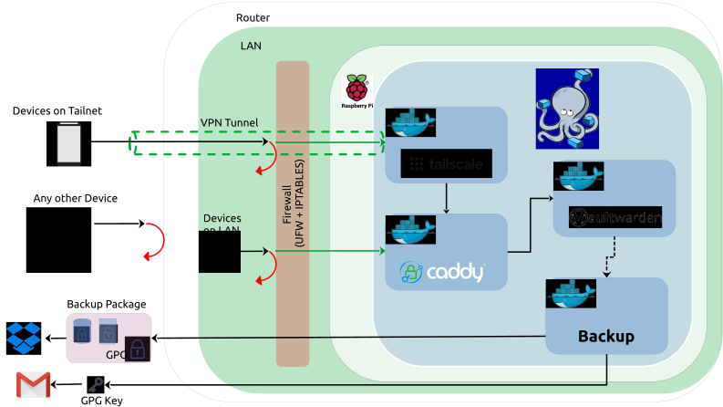

# Vaultwarden Raspberry PI

A self-hosted Vaultwarden (Bitwarden) deployment, accessible via LAN and seamlessly reachable from anywhere via VPN integration with Tailscale.



**Everything is Dockerized** apart from optional UFW and IPTABLES configuration so should be easily deployable to any system supporting Docker.

Modular setup options:

- **Flexible Domain:** 
    - Cloudflare (your domain), or 
    - DuckDNS (setup without a domain).

- **LAN or LAN+VPN:** 
    - LAN-only access, or 
    - Access from anywhere with Tailscale (VPN).

- **UFW and IPTABLES Setup (Optional):** 
    - Implement optional firewall configurations for heightened security.

- **Encrypted Backups (Optional):** 
    - Optional backups, utilizing Dropbox and Gmail.

- **Minimal Hardware Requirements:** Built/tested on a Raspberry Pi Zero 2 W.  


## Table of Contents

- [Vaultwarden Raspberry PI](#vaultwarden-raspberry-pi)
  - [Table of Contents](#table-of-contents)
  - [What is Vaultwarden?](#what-is-vaultwarden)
  - [What does this do?](#what-does-this-do)
  - [Which Modules are Available?](#which-modules-are-available)
  - [How do I install it?](#how-do-i-install-it)
    - [Using the Installer](#using-the-installer)
      - [Instructions](#instructions)
    - [Manual Installation](#manual-installation)
  - [How to fill the config file](#how-to-fill-the-config-file)
    - [Mandatory Fields](#mandatory-fields)
    - [Cloudflare or DuckDNS Fields](#cloudflare-or-duckdns-fields)
      - [Cloudflare](#cloudflare)
      - [DuckDNS](#duckdns)
    - [Tailscale Fields](#tailscale-fields)
    - [Tailscale Fields - after install](#tailscale-fields---after-install)
      - [Why do we do this?](#why-do-we-do-this)
    - [Backup Fields](#backup-fields)
      - [How to create an app password for Gmail](#how-to-create-an-app-password-for-gmail)
      - [Setting up a Dropbox App](#setting-up-a-dropbox-app)
        - [Generating the Refresh Token](#generating-the-refresh-token)
    - [IPTABLES Fields](#iptables-fields)
  - [References and Acknowledgements](#references-and-acknowledgements)
      - [Licenses:](#licenses)

## What is Vaultwarden?

Vaultwarden is a lightweight password management service, offering a lighter version of the popular open-source password manager, Bitwarden.

**Note:** This repository is for deploying a functional Vaultwarden server. For guidance on configuring and securely utilizing Vaultwarden, please refer to [The Official Vaultwarden Repository](https://github.com/dani-garcia/vaultwarden).

## What does this do?

It sets up containerized services, enabling you to self-host your own Vaultwarden (Bitwarden) service. You can host this either under a domain name you own or via a DuckDNS subdomain.

The deployment is tailored for private use, ensuring it remains unexposed to the internet. However, it can be made accessible from anywhere through VPN (Tailscale) if desired.

This setup is ideal for hosting on mini Single Board Computers (SBCs) like the Raspberry Pi Zero 2 W.

## Which Modules are Available?

- ### Barebones Setup with Cloudflare or DuckDNS
The bare bones setup sets up a Vaultwarden Service, and uses Caddy as a reverse proxy to access the Vaultwarden Service. Depeding on your DNS choice the Vaultwarden service will be accessible through your own domain name, or through a DuckDNS subdomain. It will be completely blocked to outside access as all domain names resolve to your local ip address.

- ### Optional Tailscale Service
Tailscale is a private and encrypted mesh network service that allows users to easily access resources across different devices and networks, without the need for complex configurations or a VPN setup.

Tailscale is based on WireGuard, which is a modern open-source VPN protocol known for its simplicity and efficiency.

Setting up a Tailscale container allows you to access the Vaultwarden service you are hosting to be accessible by devices on your Tailscale network, even when you are not connected to your LAN.

- ### Optional Backup Service

The backup service enhances a basic Docker Python container setup by implementing a seamless process that includes:

- Creating an encrypted backup package of your Vaultwarden Database and essential files, adhering to the [Vaultwarden Backup Guidelines.]((https://github.com/dani-garcia/vaultwarden/wiki/Backing-up-your-vault))
- Uploading this encrypted backup package to your Dropbox account.
- Notifying your Gmail account of the backup status and securely emailing you the decryption key.

While it's true that there are other well-developed backup services tailored for Vaultwarden deployments available:

- [BruceForce Vaultwarden Backup](https://github.com/Bruceforce/vaultwarden-backup/tree/main)
- [ttionya Vaultwarden Backup](https://github.com/ttionya/vaultwarden-backup)

our solution offers a unique advantage. By customizing your backup process, you gain the assurance of not solely relying on the security of a Docker container hosted externally.

- ### Optional UFW, IPTABLES Hardening

While the Vaultwarden service in this deployment is hosted locally, there's no harm implementing additional security measures. Using UFW, we isolate the machine hosting the service and restrict access to only SSH.

Additionally, we utilize IPTABLES to enhance Docker network security, ensuring that only permitted Local and Tailscale IP addresses can access the Docker network.

Furthermore, we have the capability to block specific MAC addresses within our local network from accessing the Docker Network. This feature proves useful for devices like nosy IoT devices or individuals permitted in our local network.

## How do I install it?

You can either use the included install script `utils/install.sh` or manually set everything up.

### Using the Installer

Installation is straightforward using the installer:

1. Initiate the installer with the `--init` flag to prepare your config file
2. Fill out the `./utils/config.conf` file
3. Execute the installer with the `--install` flag to complete the setup.

However, depending on your module selections, you may need to set up specific accounts. The more modules you choose, the more configuration work may be required to complete the config file.

Please read the [How to fill the config file](#how-to-fill-out-the-config-file) section for details on the modules and filling out your config file.

**IMPORTANT:** Depending on architecture you might have to replace the caddy executeable under `./caddy/caddy`. 

The caddy executable included in the repo is for Linux ARM64 (for raspberrypi).

You can download the executable for your architecture using [this link](https://caddyserver.com/download?package=github.com%2Fcaddy-dns%2Fcloudflare&package=github.com%2Fcaddy-dns%2Fduckdns)

You will need to include: 
- caddy-dns/cloudflare
- caddy-dns/duckdns

features when building the executable

#### Instructions

1. Clone or Download the repo to a local folder on your device

2. Run the installer with the `--init` flag
```bash
chomd +x ./install.sh
./install.sh --init
```

This prompts you with a few questions regarding which modules/options you want to include in your setup and prepares your config file `./utils/config.conf`

3. Fill out **all uncommented** fields in `./utils/config.conf`. See [How to fill the config file](#how-to-fill-out-the-config-file)
<br>
4. Run the installer again with the `--install` flag

```bash
./install.sh --install
```

5. Follow the instructions provided by the installer.

**Note:** The installer is designed to: 
1. Always tell you what it is about to do
2. Ask you for confirmation before it does anything. 

If you are setting this up on a fresh device (e.g., newly acquired Raspberry Pi Zero 2 W) you will have more leeway for errors.

If you're running the installer on a machine where you already have services like dnsmasq, Docker, ufw, iptables, etc., in operation, pay close attention to the installer's actions and ensure you back up your data.

Here's a brief overview of what the installer will do:

- Install various dependencies such as **docker**, **ca-certificates**, **curl**, **gnupg**, **dnsmasq**, **ufw**, **iptables-persistent** on your machine.

- After **docker** installation, if you opted to enable **Tailscale**, it will create certificates for Tailscale, grant Caddy access to Tailscale socket, obtain your Tailscale IP and update it in `*.env` and `config.conf` files where necessary.

- Configure **dnsmasq** to ensure your domain name resolves correctly to the correct IP address whether you're connecting through **LAN** or **Tailscale**.

- If you opted to enable **UFW and IPTABLES** it will install **UFW**, block all incoming connections apart from the ssh port (22), and setup **IPTABLES** such that only the **Tailscale IP Addresses** and **Local IP Addresses** you allowed in the **config.conf** can access the Docker Network. It will also blacklist any **MAC ADDRESSES** you specified in the config.conf file from accessing the Docker Network.

- Setup docker-compose service as a **systemd service** to ensure it restarts automatically at reboot.

6. After installation

- If you are using Tailscale, you will need to configure DNS settings in your Tailscale account.
See: [Tailscale Fields - after install](#tailscale-after-install)

- You will want to uncomment and create an **ADMIN_TOKEN** in ./vaultwarden/vaultwarden.env for your initial vaultwarden configuration. Please refer to the official documentation [The Official Vaultwarden Repository](https://github.com/dani-garcia/vaultwarden) about configuring and setting up Vaultwarden.

### Manual Installation

[TBD]

## How to fill the config file

The config file is divided into sections, not all fields need to be filled, and depending on your choices when you run 

```bash
chmod +x
./utils/install.sh --init
```
The fields you do not need to fill will be commented out.

We will also handle the fields here in sections

### Mandatory Fields

These fields are mandatory regardless of which option you choose. RASPBERRY_PI_STATIC_LOCAL_IP
is the static ip of the machine you are installing this deployment, does not have to be a raspberry pi. But please do set a local static ip for your machine, e.g., 192.168.1.33

```bash
#your email address
YOUR_EMAIL=me@mymail.com
RASPBERRY_PI_STATIC_LOCAL_IP=192.168.1.33
```

### Cloudflare or DuckDNS Fields

One group or the other will be commented out depending on your choices. We are going to confgure Caddy to obtain Let's Encrypt certs via the DNS challange.

See the official documentation here: [Running a Private Vaultwarden Instance with Let's encrypt Certs](https://github.com/dani-garcia/vaultwarden/wiki/Running-a-private-vaultwarden-instance-with-Let%27s-Encrypt-certs)

#### Cloudflare

If you are using cloudflare, you will need to own a domain. e.g, **mysite.com**

- Set up an A record for your domain in Cloudflare, and point it to the static ip of your device. It should look something like this


|Type|Name|Content|Proxy Status|TTL|
|---|---|---|---|---|
|A|*|192.168.1.33|DNS only - reserved IP|Auto|

- You will need an API Token from Cloudflare. See here for details [Running a Private Vaultwarden Instance with Let's encrypt Certs](https://github.com/dani-garcia/vaultwarden/wiki/Running-a-private-vaultwarden-instance-with-Let%27s-Encrypt-certs)

1. In the upper right corner, click the person icon and navigate to `My Profile`, and then select the `API Tokens` tab.
1. Click the `Create Token` button, and then `Use template` on `Edit zone DNS`.
1. Edit the `Token name` field if you prefer a more descriptive name.
1. Under `Permissions`, the `Zone / DNS / Edit` permission should already be populated. Add another permission: `Zone / Zone / Read`.
1. Under `Zone Resources`, set `Include / Specific zone / example.com` (replacing `example.com` with your domain).
1. Under `TTL`, set an End Date for when your token will become inactive. You might want to choose one far in the future.
1. Create the token and copy the token value.

Now in the config file fill out these two values. e.g,

```bash
YOUR_DOMAIN=https://vaultwarden.mysite.com
CLOUDFLARE_API_TOKEN=your_cloudflare_token
```

#### DuckDNS

If you do not have your own domain, you can also use DuckDNS to configure caddy o use a DNS Challange.

1. You will need to go to [duckdns.org](https://www.duckdns.org/) and open an account. 
1. Create a subdomain, e.g. **vaultwarden.duckdns.org**
1. Point the subdomain to your machine's static local IP, e.g. 192.168.1.33 ( write your static local ip in the current ip box)
1. Take note of your Duck DNS token

Now in the config file fill out these two values

```bash
DUCKDNS_DOMAIN=https://vaultwarden.duckdns.org
DUCKDNS_TOKEN=your_duckdns_token
```

### Tailscale Fields

If you want to use tailscale as a VPN service so that you can connect to your Vaultwarden instance remotely, you will need to register an account on Tailscale and add all devices you want to be in your Tailscale network in there.

Go to [tailscale.com](https://tailscale.com/) and create an account. At this point, register a device on your tailscale network, e.g, your laptop computer which needs remote access to your Vaultwarden Service.

In the machines section you should now see the device you registered in the Tailscale network.

The installer will setup tailscale for our deployment automatically, but it will need an authorization key.

Go to **Settings -> Keys -> Generate Auth Key** 

Generate an Auth Key with these settings:

- Expiration: anything
- Ephemeral: off
- Pre-approved: on
- Tags: anything

Generate this key and record it somewhere

Now go to DNS tab in Tailscale Admin Console, and copy your TAILNET NAME e.g. **tail0557b.ts.net**

Now you can fill out these fields in the config file

```bash
#leave this one blank, it will be filled by install.sh
TAILSCALE_IP_RASPBERRY_PI=
#tailscale domain without protocol
TAILSCALE_DOMAIN_NOPROT=tail0557b.ts.net
#give a name for your machine, eg vaultwardents
TAILSCALE_SUBDOMAIN=vaultwardents
TAILSCALE_AUTHKEY=<your_tailscale_auth_key>
```

TAILSCALE_AUTHKEY is the authorization key you just created
TAILSCALE_SUBDOMAIN is a machine name you choose for your machine that will host vaultwarden, could be anything, e.g., geronimo, or more descritively vaultwardents
TAILSCALE_DOMAIN_NOPROT is TAILSCALE_SUBDOMAIN followed by TAILNET NAME e.g., vaultwardents.tail0557b.ts.net

**NOTE:** You will need to come back to tailsclae admin console and do one last change after the installer runs

### Tailscale Fields - after install

After the installation is complete, you will see your machine that hosts vaultwarden added in tailscale with the TAILSCALE_SUBDOMAIN name of your choice.

It should have its own unique IP address, e.g, **100.100.94.876**

- Go to the DNS section in tailscale 
- Click Add Nameserver 
- Input the Tailscale IP Address of your machine here, e.g **100.100.94.876**.
- Switch **Restrict to Domain** on 
- Add your domain name in this field
    - Following our examples:
    - if using cloudflare, domain name should be mysite.com
    - if using duckdns, domain name should be duckdns.org

#### Why do we do this?

We want our domain name to always resolve to the correct machine whether we are on LAN or on Tailscale. We setup cloudflare or duckdns to resolve your domain to your local machine.

When we are on tailscale though this resolution is not going to work, so instead we configure tailscale to use the tailscale installed host machine as the DNS. The installer will install a lightweight dns forwarder (dnsmasq) to handle this dns request and make sure it resolves properly.


### Backup Fields

**Note:** You will need Dropbox and Gmail for this to run properly. You will also need to create an app token for Dropbox and setup smtp for Gmail.

**Note:** Please create a separate Gmail account for this procedure, or use an account where you do not have personal or sensitive information. Why?

1. You will need to create an app key for Gmail, which is a potential security risk if leaked
1. If your Dropbox is linked to your Gmail account, if your Gmail account gets compromised, the separation of the encrypted files and the key would not mean much.
1. Please note that even in such a case your vault would still retain its encryption.

The backup procedure uses a barebones python docker container. It archives the required files as [stated by the official vaultwarden documentation ](https://github.com/dani-garcia/vaultwarden/wiki/Backing-up-your-vault) in a gpg encrypted file and sends this file to your Dropbox.

The decrytion key for this file, along with a backup status message will be emailed to your Gmail.

#### How to create an app password for Gmail

See the [Official Documentation Here](https://support.google.com/mail/answer/185833?hl=en) to create an app password for Gmail. Please create a separate Gmail account for this procedure, or use an account where you do not have personal or sensitive information. See the note in the Backup Fields section for details.

Keep this password somewhere safe

#### Setting up a Dropbox App

We will need to setup a Dropbox App that is allowed to only read from/ write into a specific folder in Dropbox, tat is only accessible by you. For this app to work correctly you will need to generate a refresh token.

1. Navigate to [dropbox.com/developers](https://www.dropbox.com/developers) and click on App Console

2. Click on Create App, choose App folder in Scoped Accesss and then give your app a Name. let's call it **my_app**.

3. Set Allow public clients (Implicit Grant & PKCE) to Disallow


4. In the next page, make note of the App key and App secret

5. Go to **Permissions** and check

- files.metadata.read
- files.content.write
- files.content.read

##### Generating the Refresh Token

6. Now visit the following link, replace **your_app_key_here** in the link with your App Key
    - https://www.dropbox.com/oauth2/authorize?client_id=your_app_key_here&token_access_type=offline&response_type=code

7. Copy the Access Code that is generated by this link
<br>
8. Now make a curl request to obtain your refresh token.

```bash
curl https://api.dropbox.com/oauth2/token \
    -d code=<access_code_that_you_just_copied> \
    -d grant_type=authorization_code \
    -d client_id=<your_app_key> \
    -d client_secret=<your_app_secret>
```
**Noe:** If you get a code expired message, regenerate your Access Code and try again.

9. Copy the refresh token from the response.
<br>
10. In the root of your Dropbox folder, please create a folder with the same name as your app name (**my_app**) if it is not already created
<br>
10. Now you are ready to fill out these fields in the config file.


```bash
#gmail address setup with an app password
NOTIFIER_EMAIL=example@gmail.com  
#gmail app password  
NOTIFIER_APP_PASSWORD=<your_gmail_app_password>
## This is your backup schedule, it needs to be in a cronjob format
## e.g, setting this to 0 16 * * * will run the backup job on 16:00 UTC every day 
BACKUP_SCHEDULE="0 16 * * *"
DBOX_REFRESH_TOKEN=<your_dbox_refresh_token>
DBOX_APP_KEY=<your_dbox_app_key>
DBOX_APP_SECRET=<your_dbox_app_secret>
#this must be the same name of your Dropbox app
DBOX_APP_FOLDER=<your_dbox_app_name>
```

### IPTABLES Fields

These fields consist of 3 values

- ##### MAC_ADDRESSES_TO_BLOCK (Comma seperated MAC Addresses, no spaces)

These mac addresses will be blocked from accessing the docker network inside your host machine. This is useful to block IOT devices in your home, or if your share your local network with strangers, you can block their devices. Please write comma seperated MAC ADDRESSES with no spaces in between.

```bash
MAC_ADDRESSES_TO_BLOCK=AB:CD:EF:12:34:56,12:34:AB:CD:EF:78
```

- ##### LOCAL NETWORK IP RANGE (Comma seperated CIDR IP Addresses, no spaces)

These local IP addresses will be allowed to access the docker network. you can combine CIDR ranges with individual IP addresses, e.g.,

```bash
# ip addresses between 192.168.11.10  192.168.11.24, and 192.168.11.132
LOCAL_NETWORK_IP_RANGE=192.168.11.10/28,192.168.11.132
```

- ##### TAILSCALE IP RANGE (Comma seperated CIDR IP Addresses, no spaces)
These Tailscale IP addresses will be allowed to access the docker network. you can combine CIDR ranges with individual IP addresses, e.g.,

```bash
TAILSCALE_IP_RANGE=100.100.55.10/28,100.100.55.13
```

## References and Acknowledgements

- [Official Vaultwarden Repository:](https://github.com/dani-garcia/vaultwarden) The official source for Vaultwarden, which also has great articles and links to additional methods of deployment. A must visit.
- [A Better Vaultwarden Deployment:](https://nachtimwald.com/2023/11/26/a-better-vaultwarden-deployment/) A lot of the ideas/methods used here, and hardening tips are taken from this deployment by John Schember
- [Securing Access to Vaultwarden with Tailscale and Caddy](https://mijo.remotenode.io/posts/tailscale-caddy-docker/) by Michael Johansson. A deployment that uses Tailscale as an alternative to native wireguard.
- [Securing my Home Network with dnsmasq and Tailscale](https://simpsonian.ca/blog/securing-home-network-dnsmasq-tailscale/) by Simpsonian. Thanks for the tips on configuring Tailscale and dnsmasq together for consistent domain resolution.

#### Licenses:

- The cellphone, and the key icon 
    - License: [Creative Commons 3.0](https://creativecommons.org/licenses/by/3.0/)
    - Source: [TheGleeMat](https://www.iconfinder.com/TheGleeMat), and [wp-zoom-developer-icon-set](https://www.iconfinder.com/iconsets/wpzoom-developer-icon-set)


- The Laptop and the Lock Icons 
    - License: [MIT Licence](https://opensource.org/license/MIT)
    - Source: [bootstrap-icons](https://www.iconfinder.com/bootstrap-icons), and [evil-icons-user-interface](https://www.iconfinder.com/iconsets/evil-icons-user-interface)


- Other Device Icons
    - License: Free with Attribution
    - Source: [freepik](https://www.freepik.com/search?format=search&last_filter=query&last_value=devices&query=devices&type=icon)


- Dropbox, Gmail, and Docker Icons
    - License: [Creative Commons Zero v1.0 Universal](https://creativecommons.org/publicdomain/zero/1.0/deed.en)
    - Source: [iconduck](https://iconduck.com/licenses/cc0)